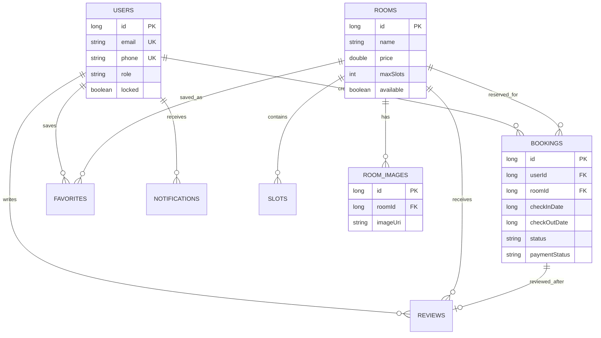
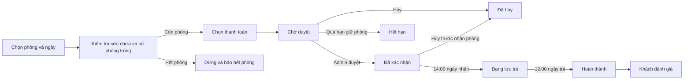

# RoomGo

RoomGo là ứng dụng Android viết bằng **Java**, mô phỏng quy trình tìm kiếm và đặt phòng homestay. Ứng dụng có hai giao diện dành cho khách hàng và quản trị viên; toàn bộ dữ liệu demo được lưu cục bộ bằng **Room/SQLite**.

> Đây là dự án học tập/bài tập lớn. Cơ chế đăng nhập và dữ liệu hiện tại phù hợp để trình diễn trên thiết bị cá nhân, chưa phù hợp để triển khai production.

## Cập nhật gần nhất

- Chuẩn hóa vòng đời booking: chờ duyệt → đã xác nhận → đang lưu trú → hoàn thành.
- Tự động cập nhật trạng thái theo giờ nhận phòng 14:00 và trả phòng 12:00 bằng WorkManager.
- Hiển thị số lượng còn trống theo dạng **Còn X/Y phòng** và cập nhật ngay khi booking thay đổi.
- Bổ sung bộ dữ liệu mẫu có nhiều trạng thái để thuận tiện trình diễn.
- Tối ưu giao diện chi tiết booking: ngày và giờ tách dòng, số đêm hiển thị bằng chip bo tròn.
- Tăng cường quy tắc hủy phòng, trạng thái thanh toán, khóa tài khoản và thông báo riêng cho khách/quản trị.
- Thêm logo RoomGo nền trong suốt ở bên trái header giao diện khách.
- Thay hộp chọn trạng thái dạng RadioButton bằng thao tác theo ngữ cảnh: xác nhận/từ chối yêu cầu, hủy booking hoặc xác nhận hoàn tiền.

## Chức năng

### Khách hàng

- Đăng ký, đăng nhập và chỉnh sửa thông tin cá nhân.
- Tìm kiếm, lọc và xem danh sách phòng đang mở.
- Xem chi tiết, tiện nghi và nhiều ảnh phòng dạng slide.
- Lưu hoặc bỏ lưu phòng yêu thích.
- Chọn ngày nhận/trả phòng, số khách và phương thức thanh toán.
- Theo dõi trạng thái đặt chỗ: chờ duyệt, đã xác nhận, đang lưu trú, hoàn thành, hết hạn hoặc đã hủy.
- Xem số lượng còn trống dạng **Còn X/Y phòng**, được tính theo khoảng ngày đã chọn.
- Hủy đặt phòng kèm lý do và thông tin hoàn tiền.
- Đánh giá phòng sau khi hoàn thành lưu trú.
- Nhận thông báo trong ứng dụng và trên thanh thông báo Android.

### Quản trị viên

- Xem tổng quan phòng, người dùng, booking và doanh thu.
- Quản lý phòng: thêm, sửa, ẩn, xóa, chọn nhiều ảnh và đánh dấu phòng nổi bật.
- Chỉ cho phép một phòng được đánh dấu nổi bật tại một thời điểm.
- Tìm kiếm, lọc và xử lý booking theo trạng thái: xác nhận hoặc từ chối yêu cầu, hủy booking và xác nhận hoàn tiền.
- Xem, chỉnh sửa, khóa hoặc xóa tài khoản khách hàng.
- Nhận thông báo riêng khi có hoạt động mới.
- Chuyển sang giao diện khách mà vẫn sử dụng được các chức năng khách hàng.

## Công nghệ sử dụng

| Thành phần | Công nghệ |
|---|---|
| Ngôn ngữ | Java 11 |
| Giao diện | XML, Material Components |
| Cơ sở dữ liệu | Android Room 2.6.1 / SQLite |
| Kiến trúc dữ liệu | DAO, Repository, Entity, Model |
| Danh sách | RecyclerView |
| Slide ảnh | ViewPager2 |
| Mật khẩu demo | jBCrypt |
| Build system | Gradle 8.13, Android Gradle Plugin 8.13.1 |
| Android SDK | compileSdk/targetSdk 36, minSdk 24 |
| Tác vụ nền | AndroidX WorkManager |

## Yêu cầu môi trường

- Android Studio phiên bản mới, có hỗ trợ Android SDK 36.
- JDK 17 để chạy Gradle/Android Gradle Plugin. Mã nguồn ứng dụng biên dịch ở mức Java 11.
- Android SDK Platform 36 và Android SDK Build-Tools.
- Thiết bị thật hoặc máy ảo Android 7.0 (API 24) trở lên.
- Git nếu tải dự án từ GitHub.
- Internet trong lần build đầu tiên để Gradle tải dependency.

## Cài đặt dự án

### 1. Tải mã nguồn

```bash
git clone https://github.com/vinh204/RoomGo.git
cd RoomGo
```

Hoặc tải file ZIP từ GitHub, giải nén rồi mở thư mục `RoomGo`.

### 2. Mở bằng Android Studio

1. Chọn **Open** trong Android Studio.
2. Chọn thư mục gốc `RoomGo` có file `settings.gradle`.
3. Chờ Android Studio hoàn tất **Gradle Sync**.
4. Nếu được hỏi JDK, chọn **Gradle JDK 17** hoặc JDK đi kèm Android Studio.
5. Mở **SDK Manager** và cài Android SDK Platform 36 nếu máy chưa có.

File `local.properties` chứa đường dẫn Android SDK được Android Studio tự tạo theo máy. Không sao chép file này từ máy khác và không commit lên Git.

### 3. Tạo thiết bị chạy thử

- Thiết bị thật: bật **Developer options** và **USB debugging**, sau đó kết nối bằng USB.
- Máy ảo: mở **Device Manager**, tạo Android Virtual Device API 24 trở lên. Nên dùng API 35 hoặc 36 để kiểm tra quyền thông báo.

### 4. Chạy ứng dụng

Chọn thiết bị trên thanh công cụ Android Studio rồi nhấn **Run app**.

Build bằng terminal tại thư mục dự án:

```powershell
# Windows
.\gradlew.bat assembleDebug
```

```bash
# macOS/Linux
./gradlew assembleDebug
```

APK debug được tạo tại:

```text
app/build/outputs/apk/debug/app-debug.apk
```

Cài APK qua ADB:

```bash
adb install -r app/build/outputs/apk/debug/app-debug.apk
```

## Tài khoản quản trị mặc định

```text
Email:    admin@gmail.com
Mật khẩu: Admin@123
```

Ở lần đăng nhập đầu tiên, ứng dụng tạo tài khoản quản trị cục bộ nếu tài khoản này chưa tồn tại. Quản trị viên có thể đổi mật khẩu trong ứng dụng.

> Không sử dụng thông tin đăng nhập hard-code theo cách này trong ứng dụng thực tế. Production cần backend, xác thực an toàn và quản lý secret phù hợp.

## Tài khoản khách mẫu

Ở lần cài mới, ứng dụng tự tạo:

```text
Email:    demo@roomgo.vn
Mật khẩu: Demo@123
```

Tài khoản này có các booking mẫu ở trạng thái chờ duyệt, đã xác nhận, đang lưu trú, hoàn thành và đã hủy.

## Hướng dẫn sử dụng

### Luồng khách hàng

1. Mở ứng dụng và chọn **Đăng ký ngay** nếu chưa có tài khoản.
2. Nhập họ tên, email, số điện thoại và mật khẩu.
3. Tại **Trang chủ**, tìm phòng hoặc chọn phòng nổi bật.
4. Mở chi tiết để lướt ảnh, xem mô tả, tiện nghi và đánh giá.
5. Nhấn **Đặt ngay**, chọn ngày, số khách và phương thức thanh toán.
6. Mở tab **Đặt chỗ** để theo dõi hoặc hủy yêu cầu.
7. Booking tự chuyển sang **Đang lưu trú** từ 14:00 ngày nhận phòng và sang **Hoàn thành** sau 12:00 ngày trả phòng.
8. Khi booking đã hoàn thành, mở booking để gửi đánh giá.
9. Mở tab **Tài khoản** để chỉnh hồ sơ, đổi mật khẩu hoặc đăng xuất.

Giờ quy ước:

- Nhận phòng: **14:00**.
- Trả phòng: **12:00**.

### Luồng quản trị viên

1. Đăng nhập bằng tài khoản quản trị mặc định.
2. Tab **Tổng quan** hiển thị số phòng, người dùng, booking chờ duyệt, doanh thu và các booking gần nhất.
3. Tab **Phòng** dùng để thêm/sửa phòng, quản lý ảnh, trạng thái mở và phòng nổi bật.
4. Tab **Đặt chỗ** dùng để tìm và xử lý booking. Booking chờ duyệt có hai lựa chọn **Xác nhận/Từ chối**; booking đã xác nhận có thể **Hủy booking**; booking đang lưu trú hoặc đã kết thúc không cho thay đổi thủ công.
5. Tab **Người dùng** dùng để xem chi tiết, sửa thông tin, đổi mật khẩu hoặc khóa khách hàng.
6. Nhấn avatar quản trị để mở menu **Xem giao diện khách** hoặc **Đăng xuất**.
7. Khi đang ở giao diện khách, mở tab **Tài khoản** để quay lại trang quản trị.

## Dữ liệu SQLite

RoomGo sử dụng database `homestay_database`, gồm các bảng chính:

- `rooms`: thông tin phòng.
- `room_images`: danh sách ảnh của từng phòng.
- `slots`: số lượng phòng còn có thể đặt.
- `bookings`: dữ liệu đặt chỗ.
- `users`: tài khoản người dùng.
- `favorites`: phòng yêu thích.
- `reviews`: đánh giá phòng.
- `notifications`: thông báo khách và quản trị.

### Sơ đồ quan hệ dữ liệu



`maxSlots` là tổng số phòng cùng loại có thể bán. Số còn trống được tính bằng `maxSlots` trừ các booking chờ duyệt, đã xác nhận hoặc đang lưu trú bị trùng khoảng ngày.

### Luồng đặt phòng



WorkManager kiểm tra vòng đời booking khi mở ứng dụng và định kỳ khoảng 15 phút. Android có thể trì hoãn tác vụ nền để tiết kiệm pin, vì vậy đây là cơ chế phù hợp cho bản demo chứ không thay thế backend trong sản phẩm thực tế.

Vị trí database trên thiết bị/emulator:

```text
/data/data/com.example.homestay/databases/homestay_database
```

Xem database trong Android Studio:

1. Chạy ứng dụng trên emulator hoặc thiết bị debuggable.
2. Chọn **View > Tool Windows > App Inspection**.
3. Mở **Database Inspector**.
4. Chọn tiến trình `com.example.homestay` và database `homestay_database`.

Database hiện ở phiên bản 18. Phiên bản này lưu thêm vai trò tài khoản, trạng thái thanh toán và thời hạn giữ phòng. Khi thay đổi Entity, cần tăng version và thêm `Migration` tương ứng trong `HomestayDatabase` để giữ dữ liệu cũ.

## Cấu trúc mã nguồn

```text
RoomGo/
├── app/src/main/
│   ├── java/com/example/homestay/
│   │   ├── HomestayApplication.java
│   │   ├── data/
│   │   │   ├── dao/             Truy vấn Room/SQLite
│   │   │   ├── database/        Database và migration
│   │   │   ├── entity/          Định nghĩa các bảng
│   │   │   ├── model/           Model hiển thị và dữ liệu kết hợp
│   │   │   └── repository/      Nguồn và nghiệp vụ dữ liệu
│   │   ├── domain/              Quy tắc đặt phòng, tìm kiếm, tính tiền
│   │   ├── ui/
│   │   │   ├── auth/            Splash, đăng nhập, đăng ký
│   │   │   ├── customer/        Trang khách và thông báo khách
│   │   │   ├── room/            Chi tiết và đặt phòng
│   │   │   ├── admin/           Các màn hình quản trị
│   │   │   └── adapter/         Adapter dùng chung
│   │   ├── utils/               Tiện ích, session và formatter
│   │   └── worker/              Tự động cập nhật vòng đời booking
│   ├── res/                      Layout, drawable, menu, màu và theme
│   └── AndroidManifest.xml
├── gradle/                       Gradle wrapper và version catalog
├── app/build.gradle              Cấu hình module ứng dụng
├── build.gradle                  Cấu hình project
└── settings.gradle               Khai báo project/module
```

## Kiểm tra dự án

```powershell
# Unit test và build APK
.\gradlew.bat testDebugUnitTest assembleDebug

# Android Lint
.\gradlew.bat lintDebug
```

Trên macOS/Linux, thay `.\gradlew.bat` bằng `./gradlew`.

Nếu máy có ít RAM:

```powershell
.\gradlew.bat --no-daemon "-Dorg.gradle.jvmargs=-Xmx768m -XX:+UseSerialGC -Dfile.encoding=UTF-8" assembleDebug
```

## Xử lý lỗi thường gặp

### Gradle Sync thất bại

- Kiểm tra kết nối Internet.
- Chọn Gradle JDK 17 tại **Settings > Build, Execution, Deployment > Build Tools > Gradle**.
- Cài Android SDK 36 trong SDK Manager.
- Nhấn **Sync Project with Gradle Files**.

### Không nhận được thông báo

- Trên Android 13 trở lên, cho phép quyền thông báo khi ứng dụng hỏi.
- Kiểm tra **Settings > Apps > RoomGo > Notifications**.
- Thông báo quản trị và khách được lưu riêng theo loại tài khoản.

### Ứng dụng lỗi sau khi thay đổi database

- Thêm migration đúng phiên bản trong quá trình phát triển.
- Nếu không cần giữ dữ liệu cũ, xóa dữ liệu ứng dụng rồi chạy lại.

### Không đăng nhập được tài khoản quản trị

- Kiểm tra đúng email `admin@gmail.com`.
- Mật khẩu mặc định chỉ áp dụng khi quản trị viên chưa đổi mật khẩu.
- Nếu quên mật khẩu ở môi trường demo, xóa dữ liệu ứng dụng để tạo lại database.

### Ảnh phòng không còn hiển thị

Ảnh chọn từ thiết bị được lưu bằng URI cục bộ. Không xóa ảnh nguồn, thu hồi quyền hoặc chuyển file sau khi thêm. Khi chuyển dữ liệu sang máy khác, cần chọn lại ảnh.

## Lưu ý phát triển

- Không truy cập Room Database trên main thread; sử dụng executor/repository hiện có.
- Khi thêm cột hoặc bảng, luôn cập nhật version và migration database.
- Chuỗi hiển thị mới nên đặt trong `res/values/strings.xml` để dễ bảo trì.
- Giữ code Java trong đúng package theo chức năng.
- Không commit `local.properties`, file build, database thiết bị hoặc thông tin bí mật.
